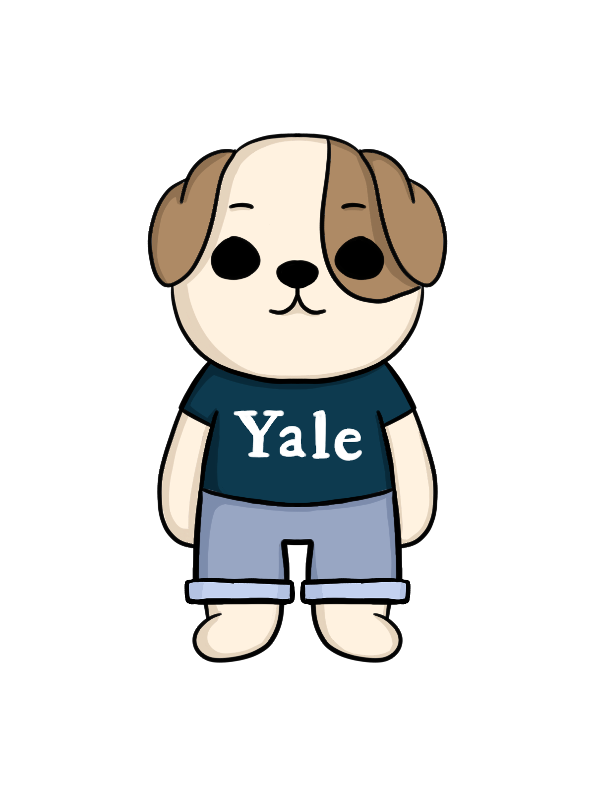

  <h1 align="center">Handsome Habits</h1>
  <em>Wini Aboyure, Julian Tweneboa Kodua, Aminata Sakho, and Tyler Norsworthy*</em>

    

## Table of Contents

1. [About the Project](#about-the-project)

   - [Description](#description)
   - [Features](#features)
   - [Screenshots](#screenshots)
   - [Project Demo](#demo)
   - [Built With](#built-with)
   - [Metric Tracking](#metric-tracking)

2. [Getting Started](#getting-started)
   - [Prerequisites](#prerequisites)
   - [Installation](#installation)
3. [Usage](#usage)
   - [Run Locally](#running-locally)
   - [Testing](#testing)
4. [Support](#support)
5. [Privacy Policy](#privacy-policy)

## About the Project

### Description

Handsome Habits makes personal wellness fun by linking your habits to the well-being of our very own Handsome Dan.

For Yale students, balance often seems unachievable. While Yale students are often very successful, this comes at the expense of their overall wellness. Handsome Habits makes wellness simple and enjoyable by providing a gamified view for maintaining personal wellness. By logging meals, sleep, study sessions, and workouts, users can earn wellness points to keep Handsome Dan happy and coins to buy him accessories. Conversely, if habits start to fall behind, Handsome Dan will become sad and disheveled to motivate the user to get back on track.

### Features

- **Log Habits:** add and view habits for studying, sleeping, eating, or exercising.
- **Track your wellnes:** Handsome Dan will indicate how well you're doing with his emotions and messages. There is also a wellness bar to see exactly how you're doing. (See Figure 1)
- **Buy rewards:** earn coins when you log a habit to buy Handsome Dan new clothes.
- **Customize Handsome Dan:** change Handsome Dan's outfit and accessories.
- **Reminders:** Get notified when it's been a while since you logged a habit.

### Demo

### Screenshots

<figure>
    
    <figcaption>Figure 1. Home page of the App</figcaption>
</figure>

### Built With

### Metric Tracking

We created 3 different buttons that lead to the store on our app. We used the epsilon-greedy method (Multi Armed Bandit procedure) to determine the best button to use. We tracked the number of clicks on each button and the number of times each button was shown. We then calculated the click-through rate (expectation) for each button. Whenever the app starts up, for 90% of the time, the button with the highest expectation is shown. For the other 10% of the time, a random button is shown. This allows us to explore the other buttons and potentially find a better button to use at any point in time.

## Getting Started

### Prerequisites

Install the following:

&nbsp;`brew install node`

&nbsp;`brew install watchman`

&nbsp;`npm install -g expo-cli`

&nbsp;`gem install cocoapods`

Ensure XCode and the XCode simulator are installed

### Installation

To run the app locally, follow these steps:

1.  Clone this repository.
2.  Install dependencies.
    _from main directory_

         `cd client;

    npm install`

        `cd client/ios;

    pod install`

        `cd server;

    npm install`

3.  Request `.env` specifications from a contributor

## Usage

### Running Locally

1. To run the servier, change `EXPO_PUBLIC_PROD=0` to `EXPO_PUBLIC_PROD=1` in `.env`
2. To run the client, `cd client;
npm run ios`
3. iOS simulator will open and you can use the app!

### Testing

1. To run lint tests in the server or client: `npm run lint`
2. To run jest tests and a coverage report in the server: `npm run test-coverage`
3. To add a test, create a new file with the `.test.js` extensions in `client/__tests__` or `server/__tests__`

## Support

Please direct any questions or concerns to handsomehabitsyale@gmail.com

## Privacy Policy

Our app collects user information during sign-in, including: name, email, and gmail account id. We also parse yalies.io for Yale relateed information, such as residential college, in order to give rewards. This data is not shared with anyone nor is any sensitive information stored. Your data will be stored as long as your account is active. If you wish to terminate your account, simply email handsomehabitsyale@gmail.com.
